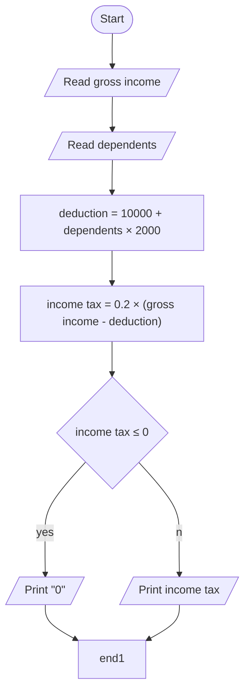

# Tutorial 1A

## Q1. 

```
BEGIN
    READ mark
    CASE OF mark
        0 TO 39
            PRINT "U"
        40 TO 44
            PRINT "S"
        45 TO 49
            PRINT "E"
        50 TO 54 
            PRINT "D"
        55 TO 59
            PRINT "C"
        60 TO 69
            PRINT "B"
        70 TO 100
            PRINT "A"
    ENDCASE
END
```

## Q2.

### Flowchart



### Pseudocode

```
BEGIN
    READ Gross income
    READ Dependents
    Deduction = 10000 + Dependents × 2000
    Income tax = 0.2 × (Gross income - Deduction)
    IF Income tax ≤ 0
        PRINT "0"
    ELSE 
        PRINT Income tax
END
```

### Test plan

| Gross income input | Dependents input | Expected Output                    | Reason for test item |
| ------------------ | ---------------- | ---------------------------------- | -------------------- |
| 14000              | 1                | 400                                | Normal data          |
| 23000              | 3                | 1400                               | Normal data          |
| 10000              | 0                | 0                                  | Extreme data         |
| 14000              | 5                | 0                                  | Extreme data         |
| 1000               | 0                | 0                                  | Extreme data         |
| 90000              | 1                | 15600                              | Extreme data         |
| 20000              | 5                | 0                                  | Extreme data         |
| test               | test             | Error: inputs must be integers     | Abnormal data        |
| -1                 | 2                | Error: inputs must be non-negative | Abnormal data        |